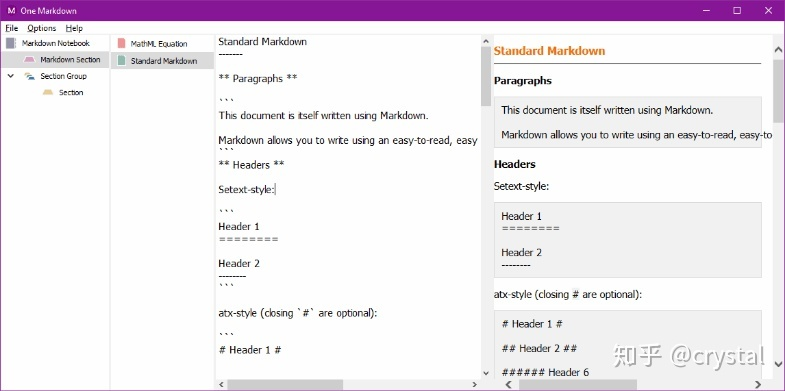
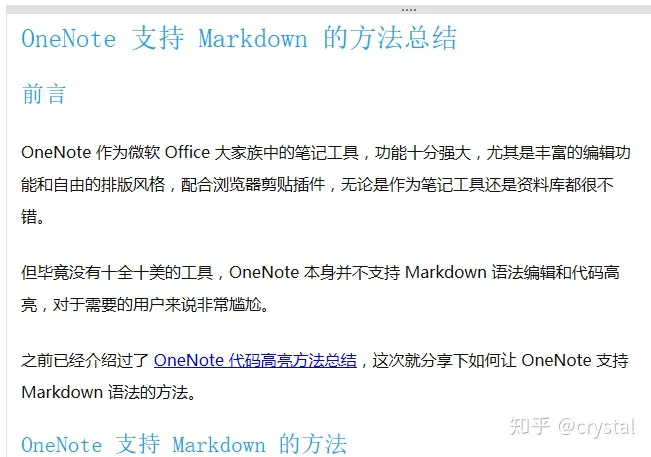

# OneNote支持Markdown语法的方法

OneNote 作为微软 Office 大家族中的笔记工具，功能十分强大，尤其是丰富的编辑功能和自由的排版风格，配合浏览器剪贴插件，无论是作为笔记工具还是资料库都很不错。但毕竟没有十全十美的工具，OneNote 本身并不支持 Markdown 语法编辑和代码高亮，对于需要的用户来说非常尴尬。这次就分享下如何让 OneNote 支持 Markdown 语法的方法。
# OneNote 支持 Markdown 的方法
OneNote 本身并不支持 Markdown 语法，因此只能从外部辅助工具入手，我们可以使用插件或富文本导入。  
OneNote 辅助插件 Gem 里包含了 Markdown 转换功能，可以一键在 Markdown 文本和 OneNote 文本之间切换。  
插件官网：[Gem for OneNote](https://www.onenotegem.com/a/addins/gem-for-onenote.html)  
## 使用
官网下载并安装插件，然后打开 OneNote，工具栏中会出现一个 “珍” 标签 - 标记文本。文本框中编辑 Markdown 文本后，点击 “标记文本” 按钮，即可转换为 OneNote 正常文本，再次点击切换回 Markdown。  
  
语法支持：标题、引用、列表、图片、链接、分隔线、代码块、待办清单、文本样式（粗体、斜体、行内代码）等……
## 高级语法支持
Gem 插件中带的 Markdown 功能支持的语法有限，如表格、流程图、目录、代码高亮、数学公式、LaTeX 等语法，需要安装专门的 One Markdown 独立客户端链接 OneNote 使用。  
  
该工具相当于一个辅助编辑器，支持 Windows、安卓和 iOS，在工具中编辑 Markdown 后，将渲染后的文本同步至 OneNote 中。  
地址：[One Markdown](https://link.zhihu.com/?target=https%3A//www.onenotegem.com/one-markdown.html)
## Markdown 导出富文本到 OneNote
如果已经有用的比较顺手的 Markdown 编辑器了，可以使用编辑器的导出功能，将 Markdown 文档导出为 Word 等富文本格式，然后复制到 OneNote 中。  
  
虽然比起直接在 OneNote 中转换多了一步操作，倒也不麻烦，但是编辑体验更好，而且可以完整保留原编辑器的渲染样式。  
# 结语
OneNote 支持 Markdown 的方法现在就这两个，体验还可以。Gem 插件比较方便，导出富文本粘贴的话样式更好看。  

